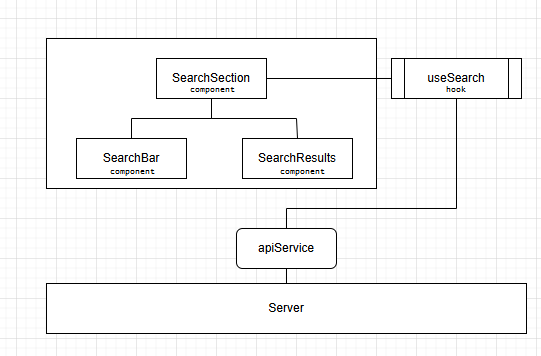
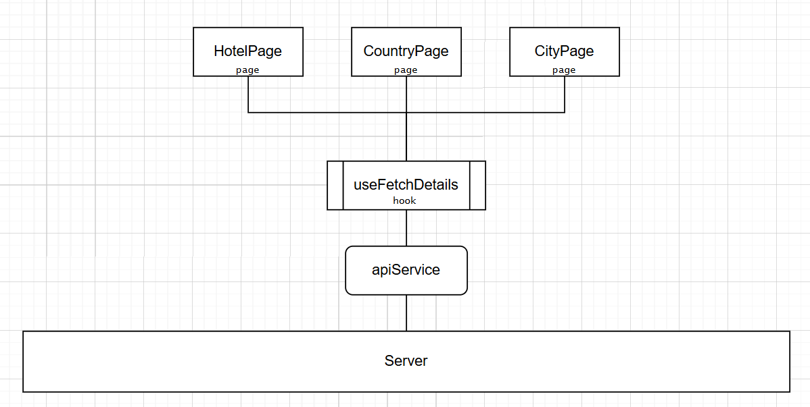

# Accommodation Search

## Technical Coding Test

This project has a simple setup with an api, hooked up to MongoDB and a frontend piece initiated with [vite](https://vitejs.dev/).

## Install and run

From the project root:

```
npm install
```

### Run

Once install has finished, you can use the following to run both the API and UI:

```
npm run start
```

### API

To run the API separately, navigate to the `./packages/api` folder

```
$ cd packages/api
```

And run the `api` server with

```
$ npm run dev
```

The API should start at http://localhost:3001

### Client

To run the `client` server separately, navigate to the `./packages/client` folder

```
$ cd ./packages/client
```

And run the `client` with

```
$ npm run start
```

The UI should start at http://localhost:3000

### Database connection & environment variables

By default, the code is set up to start and seed a MongoDB in-memory server, which should be sufficient for the test. The database URL will be logged on startup, and the seed data can be found at ./packages/api/db/seeds.

If this setup does not work for you or if you prefer to use your own MongoDB server, you can create a .env file. In the ./packages/api folder, create a .env file (or rename the existing .env.sample) and fill in the environment variables.

## Task at hand

When the project is up and running, you should see a search-bar on the screen. This one is currently hooked up to the `/hotels` endpoint.
When you type in a partial string that is part of the name of the hotel, it should appear on the screen.
Ie. type in `resort` and you should see some Hotels where the word `resort` is present.

You will also see 2 headings called **"Countries"** and **"Cities"**.

The assignment is to build a performant way to search for Hotels, Cities or Countries.
Partial searches will be fine. Hotels will need to filterable by location as well.
Ie. The search `uni` should render

- Hotels that are located in the United States, United Kingdom or have the word `uni` in the hotel name.
- Countries that have `uni` in their name Ie. United States, United Kingdom
- No Cities as there is no match

Clicking the close button within the search field should clear out the field and results.

When clicking on one of the `Hotels`, `Cities` or `Countries` links, the application should redirect to the relevant page and render the selected `Hotel`, `City` or `Country` as a heading.

### Limitations

Given the time constraints, we do not expect a fully production-ready solution. We're primarily interested in the approach and the overall quality of the solution. 
Feel free to modify the current codebase as needed, including adding or removing dependencies. 
For larger or more time-intensive changes, you're welcome to outline your ideas in the write-up section below and discuss them further during the call.


### Write-up

<!-- Write-up/conclusion section -->


#### Description

The search functionality allows users to find hotels, cities and countries based on the typed input. The search process and filtering happens in the backend using the capabilities of MongoDB, and works as follows:

- Hotels: Matches the input string with a word in the hotel name. Also retrieves hotels located in countries where the country name starts with the input string.
- Countries: Matches countries whose names start with the input string.
- Cities: Matches cities whose names start with the input string.

The filtering strategy is flexible and can be easily modified using the query builder, allowing future adjustments and refinements.

When the close button is clicked, the search field and the results are cleared. Currently, the dropdown stays open to showcase that the results have been effectively cleared.

When clicking on one of the hotels, countries or cities, the application redirects to their details page where their name is displayed. 
The pages have currently a similar UI but have been implemented separately so that they can be customized and extended independently in the future.

#### Packages

Following packages have been added to the project:
- react-router-dom
- validator

#### Tasks performed

Backend:
- Separated database logic into a dedicated service, ensuring that database connections are not repeatedly opened and closed on each API call.
- Added routes and API logic to: 
  - fetch a single item by ID.
  - fetch multiple items using a search term.
- Developed a query builder for flexible and maintainable search queries.
- Added input sanitization.
- Optimized API responses by fetching only the necessary fields from the database.
- Added indexes to improve database query performance.

Frontend:
- Created modular components (see components tree).
- Implemented the functionality to clear search results.
- Integrated react-router-dom to manage frontend routing.
- Created dedicated pages.
- Ensured filtering is handled in the backend to avoid unnecessary processing on the frontend.
- Implemented a dedicated API service to handle backend interactions.
- Implemented debouncing for API calls, reducing the amount of requests while searching.

Components tree for the search functionality:



Detail pages:




#### Suggestions

Several potential improvements could enhance both the functionality and performance of the application further:
- Limiting fetched and displayed results to improve performance and user experience. Implementing sorting mechanisms would help determine which results to display first (e.g. by location, popularity, rating).
- Implementing a caching mechanism to store recent search results would help reduce redundant database queries and improve search performance.
- Reintroducing filtering by hotel chain name and city. Initially the application supported filtering on these fields. Restoring this functionality in the future could improve search precision and user experience.
- Displaying hotel locations in the results would provide more clarity to the end user.
- Enhancing testing would improve system reliability. 
- Other changes: logo192.png seems to be missing.


### Database structure

#### Hotels Collection

```json
[
  {
    "chain_name": "Samed Resorts Group",
    "hotel_name": "Sai Kaew Beach Resort",
    "addressline1": "8/1 Moo 4 Tumbon Phe Muang",
    "addressline2": "",
    "zipcode": "21160",
    "city": "Koh Samet",
    "state": "Rayong",
    "country": "Thailand",
    "countryisocode": "TH",
    "star_rating": 4
  },
  {
    /* ... */
  }
]
```

#### Cities Collection

```json
[
  { "name": "Auckland" },
  {
    /* ... */
  }
]
```

#### Countries Collection

```json
[
  {
    "country": "Belgium",
    "countryisocode": "BE"
  },
  {
    /* ... */
  }
]
```
